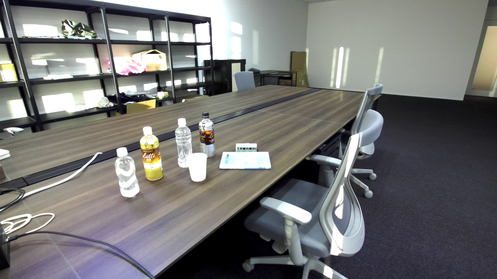

# ZED SDK との連動がないスクリプトの実行例

## GrounedSAM それ自体について

### gsam_movie.py
以下のpythonスクリプトは、USBカメラ入力に対して、--text_prompt　に示される対象物に対して
インスタンスセグメンテーションを実施して、--output_dir に保存するスクリプトである。
```commandline
Grounded-Segment-Anything# python3 gsam_movie.py -h                                                   
usage: gsam_movie.py [-h] [--use_sam_hq] --text_prompt TEXT_PROMPT --output_dir OUTPUT_DIR [--box_threshold BOX_THRESHOLD]
                     [--text_threshold TEXT_THRESHOLD]

Grounded-Segment-Anything for USB camera

optional arguments:
  -h, --help            show this help message and exit
  --use_sam_hq          using sam-hq for prediction
  --text_prompt TEXT_PROMPT
                        text prompt
  --output_dir OUTPUT_DIR, -o OUTPUT_DIR
                        output directory
  --box_threshold BOX_THRESHOLD
                        box threshold
  --text_threshold TEXT_THRESHOLD
                        text threshold
```

#### 一つのカテゴリーを指定の場合
```commandline
Grounded-Segment-Anything# python3 gsam_movie.py --text_prompt bottle --output_dir outputs
```

 label='bottle(0.66)'
box=tensor([775.7297, 522.5960, 855.9427, 747.6776]) label='bottle(0.67)'
box=tensor([619.6656, 559.8273, 727.5184, 805.8596]) label='bottle(0.68)'
box=tensor([507.3223, 652.8929, 622.1536, 880.7135]) label='bottle(0.67)'
box=tensor([ 973.3555,  671.3052, 1206.4487,  756.2626]) label='book(0.39)'
box=tensor([828.6876, 678.2758, 922.6061, 811.3488]) label='cup(0.68)'
box=tensor([ 972.5889,  634.5367, 1207.4060,  757.1379]) label='book(0.35)'
略
```




```:captured_0002_mask.json
[{"value": 0, "label": "background"}, {"value": 1, "label": "bottle", "logit": 0.66, "box": [882.1499633789062, 496.5115051269531, 957.7581787109375, 703.1181640625]}, {"value": 2, "label": "bottle", "logit": 0.68, "box": [775.8727416992188, 522.694091796875, 855.7272338867188, 747.4675903320312]}, {"value": 3, "label": "bottle", "logit": 0.69, "box": [619.7833251953125, 559.8886108398438, 727.797119140625, 805.8375244140625]}, {"value": 4, "label": "bottle", "logit": 0.68, "box": [507.5815734863281, 652.99072265625, 622.3192749023438, 880.9000244140625]}, {"value": 5, "label": "cup", "logit": 0.69, "box": [825.576904296875, 678.4196166992188, 922.5826416015625, 811.3165893554688]}, {"value": 6, "label": "book", "logit": 0.35, "box": [973.5555419921875, 671.3574829101562, 1206.4371337890625, 756.1993408203125]}, {"value": 7, "label": "book", "logit": 0.37, "box": [972.8187255859375, 634.828125, 1207.2337646484375, 757.08203125]}]
```

このように、text_promt に示されたカテゴリの物体に対して
- box領域での検出とラベルと信頼度
- インスタンスセグメンテーション
とを返すことができます。text_promtに入力可能な文字列は、GroundedSAMが学習している範囲の文字列になります。
